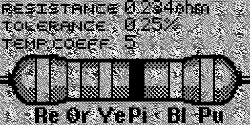

# Resistance calculator

A simple app to calculate resistance from the coloured bands, based on original work by [Lewis Westbury](https://github.com/instantiator/flipper-zero-experimental-apps/tree/main/resistors). 

* Pick from 3, 4, 5, or 6 band resistor.
* Left and right to move the current focus, up and down to adjust the coloured bands.
* Resistance, tolerance, and temperature coefficient are updated instantly.
* This version shows friendly resistance values, supports Pink color bands, and adds three missing Temp Coefficients (+-1, +-20, +-250).

