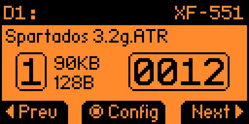
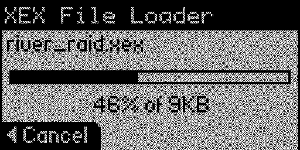

# Atari SIO Peripheral Emulator for Flipper Zero

sio2flip is a Flipper Zero application that emulates SIO peripherals for Atari 8-bit computers. The project is still in its early stages, but now it features quite good support for floppy drive emulation. Additionally, besides FDD emulation, direct XEX executable file loading is now supported.

## What's tested

The app has been tested with the PAL version of the Atari 800XL. It appears to be quite functional, allowing the system to boot from various ATR image files. The following features have already been implemented:

- Sector reading and writing commands
- Disk formatting commands
- Commands for reading and writing PERCOM configuration
- US Doubler mode is emulated (with either 38400 Bd or 57600 Bd).
- XF-551 High Speed mode is emulated 
- Support for 90K, 130K, 180K, 360K, and 720K ATR disk images
- 128- or 256-byte sectors are supported
- Up to four floppy disk drives can be emulated.
- Direct XEX executable file loading

## Wiring

The wiring is quite simple; only three signals are need. 

| Flipper pin  | Atari SIO |
| ------------ | --------- |
| TX (13)      | DIN       |
| RX (14)      | DOUT      |
| C0 (16)      | COMMAND   |
| GND (18)     | GND       |

Note: All signals on the Atari SIO use 5V TTL logic. Although the Flipper Zero’s I/Os are 5V tolerant when configured as inputs, be careful when connecting your Flipper Zero to your Atari computer, as incorrect wiring or improper use could potentially damage your Flipper or your precious Atari hardware.

## Instructions for Use

The emulator accepts disk images in ATR format and XEX executables. Copy the ATR files to the SD card at **/apps_data/sio2flip/atr/** and the XEX files to **/apps_data/sio2flip/xex/**.

## TODO

I have some plans, but I’m not sure if or when I’ll be able to complete them all.

- Use how-speed SIO with XEX file loader
- Add CAS file emulation
- Improve error signaling to host via FDD status byte
