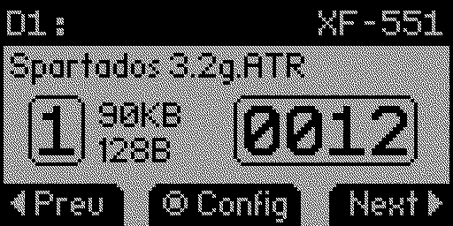

# Atari SIO Peripheral Emulator for Flipper Zero

sio2flip is a Flipper Zero application that emulates SIO peripherals for Atari 8-bit computers. The project is still in its early stages, but it already features:

- **Floppy drive emulation**
  - Sector reading and writing commands
  - Disk formatting commands
  - Commands for reading and writing PERCOM configuration
  - US Doubler mode is emulated (up to 73.7 KBd).
  - XF-551 High Speed mode is emulated
  - Support for 90K, 130K, 180K, 360K, and 720K ATR disk images
  - Support for hard disk images up to 16MB
  - 128- or 256-byte sectors are supported
  - Up to four floppy disk drives can be emulated.
- **Direct XEX executable file loading**
  - Now runs at 19200 Bd, using 1 KB transfer blocks
- **Atari 850 modem emulation**
  - Modem bridged to a second USB CDC (virtual COM port)


<div>


</div>

## Wiring

The wiring is quite simple; only three signals are need.

| Flipper pin  | Atari SIO |
| ------------ | --------- |
| TX (13)      | DIN       |
| RX (14)      | DOUT      |
| C0 (16)      | COMMAND   |
| GND (18)     | GND       |

Note: All signals on the Atari SIO use 5V TTL logic. Although the Flipper Zero’s I/Os are 5V tolerant when configured as inputs, be careful when connecting your Flipper Zero to your Atari computer, as incorrect wiring or improper use could potentially damage your Flipper or your precious Atari hardware.


## Instructions for Use

The emulator supports ATR disk images and XEX executables. To use them, copy the files to the SD card as follows:
- ATR files: **/apps_data/sio2flip/atr/**
- XEX files: **/apps_data/sio2flip/xex/**

For Atari 850 emulation, you need to provide the Atari 850 ROM file. Copy the ROM content to:
- **/apps_data/sio2flip/atari850.rom**

Note: I cannot include the ROM file with the app, so you’ll need to provide it yourself. The file must be exactly 4 KB in size and have the following SHA-256 checksum:
5c490a04d9936a87d3f9b6919ddaccbde30e3fb37f03a7557695d0c33f47bb8a.


## How to Connect Your Atari to the Internet

You can use the excellent 80-column Ice-T terminal, available on the AtariAge forum.
There you’ll also find there a link to ready-to-run ATR images that include everything you need.


Steps:
1.	Enable Atari 850 emulation from the sio2flip main menu and select Start emulation…
2.	Boot an ATR image containing DOS, RS232.COM, and ICET.COM
(Hold the OPTION key during boot to disable the built-in BASIC ROM)
3.	Load and run RS232.COM. This will download the R: driver from the emulator and install it.
4.	Load and run ICET.COM.
5.	Connect your Flipper Zero via USB. Two virtual COM ports will appear:
    - First port: Flipper CLI
    - Second port: Atari SIO bridge

6. Run the bridge.py script from this repository:

```sh
python3 bridge.py <sio_vcp> <server>
```


## About This Project

There are several great SIO peripheral emulators available, many more advanced than this project.
However, none run on the Flipper Zero - so I built this purely for enjoyment. 😄

Contributions, ideas, feedback, and bug reports are welcome!

Planned improvements (time permitting):
- Add high-speed SIO support to the XEX file loader
- Add CAS file playback (cassette recorder emulation)
