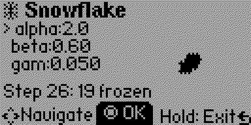

# mitzi-snowflake
A simple Flipper Zero app to create nice-looking 60° or 120° graphics. 
Watch the iterative growth of a snowflake on 64x64 pixels. 

## Usage
* **Up/Down:** Decrease/Increase the selected parameter value
* **Left/Right:** Navigate between parameters (move cursor)
* **OK:** Grow snowflake one step
* **Short Back:** Reset snowflake
* **Long Back:** Exit app

## Scientific background

- Clifford A. Reiter: *A local cellular model for snow crystal growth.* (2004), see e.g. [PDF](https://www.patarnott.com/pdf/SnowCrystalGrowth.pdf)
- Student project by **Yan Huck** at University Frankfurt: *[A Cellular Automaton Model for Snow Crystal Growth](https://itp.uni-frankfurt.de/~gros/StudentProjects/Projects_2020/projekt_yan_huck/)?

## Version history
See [changelog.md](changelog.md)
