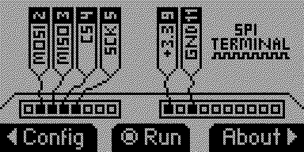
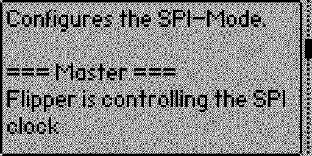
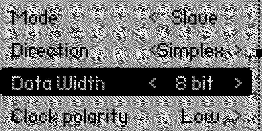
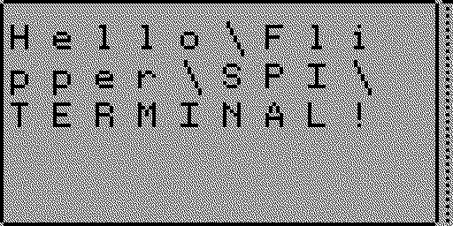
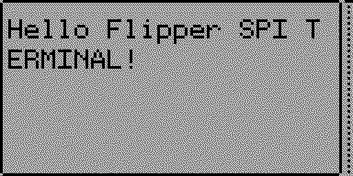
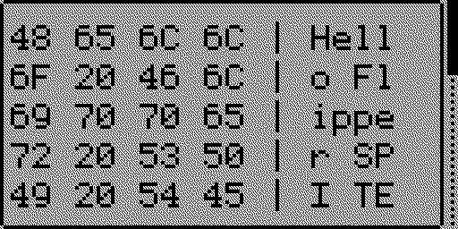
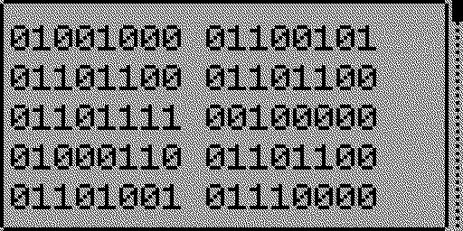

# Flipper SPI Terminal <!-- omit in toc -->



SPI TERMINAL is a SPI App, which allows you to control external devices using SPI. Your Flipper can act as a SPI Master or Slave device. The Slave mode allows you to sniff the communication between different SPI peripherals.

The App uses the Low-Level SPI Interface of the STM32WB55RG Microprocessor. All data is transmitted with DMA Sub-module and can reach speeds of up to 32 Mbit/s in Master and up to 24 Mbit/s in Slave mode.

It contains a rich [Inbuilt Documentation](#inbuilt-documentation).



> [!IMPORTANT]
> The current version does not support the sending of data. This is planned for future versions.

> [!IMPORTANT]
> Flipper SPI Terminal requires full control over Flipper Zero's `SPI Bus R`/`SPI1`. Due to this, all access to it and it's connected peripherals is blocked up on entering the Terminal Screen. This includes access to the SD-Card. All SD accesses (i.e.: qFlipper, lab.flipper.net, iOS/Android App) will result in a crash and you'll need to reset you Flipper by simultaneously holding down the `Left` and `Back` buttons.

## Contents <!-- omit in toc -->

- [Installation](#installation)
  - [Flipper Apps Catalog (Recommended)](#flipper-apps-catalog-recommended)
  - [GitHub](#github)
  - [Building Flipper SPI Terminal](#building-flipper-spi-terminal)
- [GPIO](#gpio)
- [Configuration](#configuration)
- [Terminal Screen](#terminal-screen)
- [Inbuilt Documentation](#inbuilt-documentation)
- [CLI](#cli)
- [Contribute/Debugging](#contributedebugging)
- [External References](#external-references)

## Installation

### Flipper Apps Catalog (Recommended)

<https://lab.flipper.net/apps/flipper_spi_terminal>

### GitHub

1. Head over to the [Releases](https://github.com/janwiesemann/flipper-spi-terminal/releases) section
2. Download the latest `flipper_spi_terminal.fap`
3. Place `flipper_spi_terminal.fap` on your microSD's `/apps/GPIO/` folder.

### Building Flipper SPI Terminal

1. Install [uFBT](https://github.com/flipperdevices/flipperzero-ufbt) and [git](https://git-scm.com).
2. Open a commandline and navigate to a directory of your liking.
3. Connect Flipper Zero to your computer using a USB cable.
    > [!NOTE]
    > If you just want to build Flipper SPI Terminal but don't want to install it, change the last command, from the next step, from `ufbt launch` to `ufbt`.
4. Run the following command(s) to clone, build and install Flipper SPI Terminal to your Flipper Zero.

    ```bash
    git clone https://github.com/janwiesemann/flipper-spi-terminal.git
    cd flipper-spi-terminal
    ufbt launch
    ```

## GPIO

> [!CAUTION]
> Do not use 5V signals! Flipper Zero is only 5V tolerant, if a pin is configured as input. If you connect a 5V signal to a output, it will damage your Flipper!
> For details see: <https://docs.flipperzero.one/gpio-and-modules#svyi9>

| Pin     | Label  | Description                    |
|---------|--------|--------------------------------|
| 2 (PA7) | MOSI   | Master out / Slave in          |
| 3 (PA6) | MISO   | Master in / Slave out          |
| 4 (PA4) | CS/NSS | Chip select / Non Slave Select |
| 5 (PB3) | SCK    | Serial Clock                   |

## Configuration

SPI Terminal offers access to all of the Flipper Zero SPI settings. Your configuration will be reloaded on the next launch. The config file is located at `/ext/apps_data/flipper_spi_terminal/last_settings.settings`.

> [!TIP]
> The full list of configuration options found in [`flipper_spi_terminal_config_declarations.h`](https://github.com/janwiesemann/flipper-spi-terminal/blob/master/flipper_spi_terminal_config_declarations.h).



> [!NOTE]
> A few advanced settings can only be accessed though the Flipper CLI. Please refer to the [CLI](#cli) section for details.

## Terminal Screen

The Terminal Screen is the main part of this application. Is can display received data in multiples modes. Currently they are:

- **Auto:**
  Printable chars are rendered. Special chars (`\ ` (space), `\n`, `\r`, ...) are rendered using there C escape sequence. Everything else is rendered as Hex.
  
- **Text:**
  Printable chars are rendered. Non-printable are rendered as empty space.
  
- **Hex:**
  
- **Binary:**
  

New data is added in a rolling buffer. This means, that the screen can be rendered without the need of copying huge amounts of data.

## Inbuilt Documentation

Flipper SPI Terminal contains a inbuilt documentation for each configuration setting. It can be accessed though the `Center` button on the configuration screen.


> [!NOTE]
> For a deeper understanding of all the configuration options and there affect, I would recommend the [STM Reference Manual RM0434](https://www.st.com/resource/en/reference_manual/rm0434-multiprotocol-wireless-32bit-mcu-armbased-cortexm4-with-fpu-bluetooth-lowenergy-and-802154-radio-solution-stmicroelectronics.pdf). The SPI-Section (`Section 35.`) is located on page `1177`.

## CLI

Flipper SPI Terminal offers a limited set of CLI-Commands. They are currently only used for debugging purposes.

A list of commands and there uses can be printed with `spi help`

> [!TIP]
> A full list can also be found in [`flipper_spi_terminal_cli_commands.h`](https://github.com/janwiesemann/flipper-spi-terminal/blob/master/flipper_spi_terminal_cli_commands.h).

## Contribute/Debugging

Feel free to contribute to Flipper SPI Terminal and to submit a Pull request. Make sure you're adding a reference to your contribution into the about scene located at `scenes/scene_about.c` (`const char* about_text = "..."`).

I heavily recommend the use of a debugging probe. The [WiFi Devboard for Flipper Zero](https://shop.flipperzero.one/products/wifi-devboard) isn't a good choice, since It's connecting the SPI pins to the ESP32. This can cause some issues. Generally, Flippers SPI pins do not overlap with the SWD pins, enabling the use of a SPI and SWD probe at the same time. I'm using a SEGGER J-Link probe but there are certainly cheaper options available. Only using Flipper Zero's Logging system is not really feasible, since they are not working in interrupts and often lack behind the actual execution point.

For development purposes it's a good idea to use a SPI dive you can fully control. I'm using a WeMos D1 clone for this. The Arduino sketches are located in `ext_test_app/`.

A few purpose built debug commands are available though the Flipper CLI. See [CLI](#cli) for details.

## External References

- **STM32F7 SPI presentation:**
  <https://www.st.com/content/ccc/resource/training/technical/product_training/group0/3e/ee/cd/b7/84/4b/45/ee/STM32F7_Peripheral_SPI/files/STM32F7_Peripheral_SPI.pdf/_jcr_content/translations/en.STM32F7_Peripheral_SPI.pdf>
- **STM32 Reference Manual RM0434:**
  <https://www.st.com/resource/en/reference_manual/rm0434-multiprotocol-wireless-32bit-mcu-armbased-cortexm4-with-fpu-bluetooth-lowenergy-and-802154-radio-solution-stmicroelectronics.pdf>
- **STM32 Application Note AN4899 on 5V tolerance:**
  <https://www.st.com/resource/en/application_note/dm00315319-stm32-gpio-configuration-for-hardware-settings-and-lowpower-consumption-stmicroelectronics.pdf>
- **Flipper Zero GPIO & modules:**
  <https://docs.flipper.net/gpio-and-modules>
- **Flipper Zero CLI:**
  <https://docs.flipper.net/development/cli>
- **Flipper uFBT:**
  <https://github.com/flipperdevices/flipperzero-ufbt>
