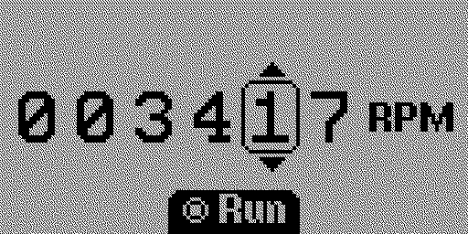

# Flipper StroboMeter

## Description

Flipper StroboMeter is an application designed to measure the RPM (revolutions per minute) of a rotating object using the Flipper Zero device. By connecting an LED to Pin 4(A4) and GND and setting the RPM, you can emit a strobe light at that specific frequency. By going through different frequencies and seeing where the strobe effect syncs up with the frequency of the motion and the motion seems to freeze, you can measure that frequency.

## Instructions

1. **Prepare the Measurement:**

   - Identify a visible mark or feature on the rotating object that you can use as a reference point. For better visibility you can also attach a small piece of tape to it.

2. **Setting the frequency:**

   - Position the Flipper Zero so that the strobe light can illuminate the rotating object.
   - Adjust the strobe frequency using the app controls until the reference point on the rotating object appears to be stationary.

3. **Fine-Tuning:**

   - If the reference point appears to move slowly, fine-tune the strobe frequency until it is perfectly stationary for a more accurate measurement.
   - Once the reference point appears stationary, note the frequency displayed on the app.

4. **Check Multiples of the Frequency:**
   - Be aware that the strobe effect can also sync up at fractions of the actual RPM (e.g., half, third, or quarter of the true RPM). To ensure an accurate measurement, check multiples of the frequency to confirm that the reference point remains stationary at the correct RPM.
   - If you have the correct frequency, doubling it should result in a double image of you reference point

You can also use the Stroboscope to measure the frequency of any cyclical motion, not only rotation (for example speakers).

Feel free open up an issue on [GitHub](https://github.com/LeanderJDev/FlipperStroboMeterApp) if you have any suggestions!

**Disclaimer:**
Do not use LEDs without a resistor. As they are semiconductors they don't limit the current, but their resistance is actually lowered as they heat up, drawing more current and eventually breaking.
I repeat DO NOT use LEDs without a resistor.
Now that I am no longer responsible for your actions, please proceed as you wish :)
