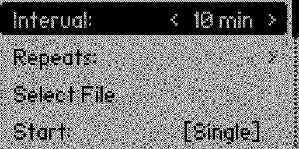
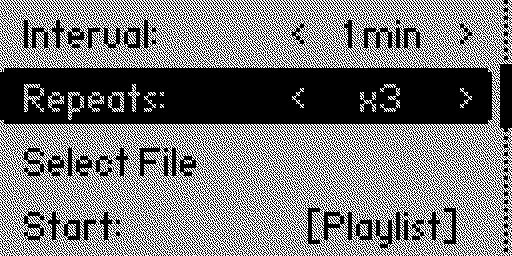
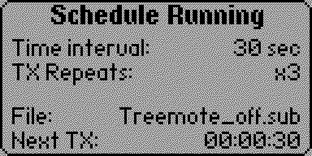

# SubGHz Scheduler

A Flipper Zero app to send SubGHz signals at a given interval. Individual `*.sub` or playlist `*.txt` files can be used.

<table style="border:0px">
  <tr style="border:0px">
    <td style="border:0px" width="25%" align="left">
    Schedule intervals selectable: <br>
     <ul>
       <li>Seconds: 10 & 30</li>
       <li>Minutes: 1, 2, 5, 10, 20, 30, 45</li>
       <li>Hours: 1, 2, 4, 8, 12</li>
     </ul>
    </td>
    <td style="border:0px" width="20%"></td>
  </tr>
 <tr style="border:0px">
  <td style="border:0px" width="25%" align="left">
    Data Tx Repeats:<br>
  <ul>
  <li>x2, x3, x4, x5, x6</li>
  </ul>
  </td>
  <td style="border:0px" width="20%"></td>
 </tr>
  <tr style="border:0px">
  <td style="border:0px" width="25%" align="left">
   Delay between playlist transmissions:<br>
   <ul>
    <li>100ms - currently hardcoded</li>
   </ul>
  </td>
   <td style="border:0px" width="20%"></td>
  </tr>
</table>


## Requirements

This app is tested against the current `dev` and `release` branches of the [OFW](https://github.com/flipperdevices/flipperzero-firmware):

* Current OFW Version: 1.2.0
<br>[](https://github.com/shalebridge/flipper-subghz-scheduler/actions/workflows/build.yml)

## Build

These apps are built using [ufbt](https://pypi.org/project/ufbt/) - a subset of the flipper build tool (fbt) targeted at building apps. Install it with:

```bash
pip install ufbt
```

For build only, run `ufbt` from the terminal in the project directory. To upload, make sure Flipper is connected to your computer and run `ufbt launch`.

The directory contains the following batch script(s) to simplify the upload process:
* `win_launch.bat` - Windows only. Invokes `ufbt` to deploy and launch the app on a flipper over USB, and resets terminal colors in case of error.

Build outputs are found in the `dist` directory for each application.


# To-Do
- [ ] Add more interval options, or make the intervals continuously adjustable instead of discrete.
- [ ] Enable option to delay first transmission. Currently, Scheduler will send immediately when started.
- [ ] Add adjustable delay between playlist transmissions. Currently hardcoded at `100ms`.
- [ ] Improve timing, synchronization, and implement threads during transmission. Currently blocking.
- [ ] Enable interval delays for playlists. For example, turning on a light (playlist index 1), then 4 hours later turning it off (playlist index 2), and run that at another arbitrary interval.
- [ ] Add one-shot function (wait desired interval before sending once).
- [ ] More visual feedback of current transmission (like `SubGHz Playlist`)
