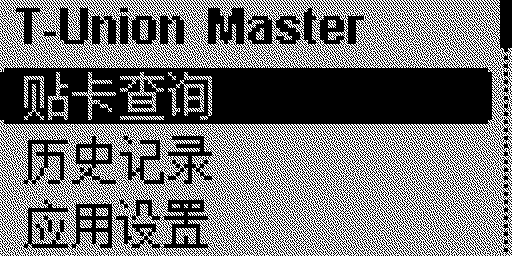
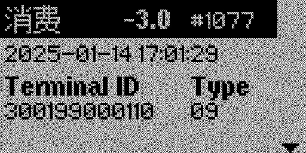
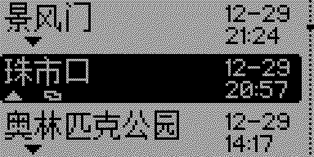

# T-Union Master

🐬🚇💳 Transportation Card Master

## 📖Description

T-Union Master is a tool based on the [flipper zero](https://flipperzero.one/) platform to query the comprehensive information of [Transportation Union Card](https://zh.wikipedia.org/wiki/%E4%BA%A4%E9%80%9A%E8%81%94%E5%90%88).

The query content includes basic information such as card number, card name, card type, expiration date, balance, recharge and transaction records (10 items), and travel information such as transportation, route, platform, etc. (30 items). The query method is offline query, and no Bluetooth wifi is required.

This application uses the built-in NFC peripheral of the flipper zero device and the ISO/IEC 14443 (Type 4A) protocol stack provided by the system firmware to communicate with the card. The application layer protocol refers to the EMV standard and the JT/T 978 standard of the Ministry of Transport.

Reference: [Card Protocol Analysis Record](docs/card_data_format.md)

Built-in GB2312 12px unequal-width Chinese character library, no Chinese firmware required, in-app information and station names are displayed in Chinese; built-in traffic route and station database, support is as follows.

[Supported cities and routes](docs/supported_cities.md)

## 💻Usage

### Main menu interface

### Basic card information

Display balance, card number, card name information

Navigation key left: Go to transaction record query

Navigation key right: Go to detailed information query

### Card Details

Display the issuance and expiration date, card issuing place and card type information

Navigation key left: Return to basic card information

### Transaction Record

Displays 10 transaction information, sorted from the most recent to the oldest, including transaction type, transaction amount, transaction sequence number, and time (month, day, hour, and minute).

Navigation key up and down: scroll record list

Navigation key left: Go to trip record query

Navigation key right: Return to basic card information

### Transaction Details

Display the type, amount, sequence number, timestamp, and terminal ID information of the selected transaction record

Navigation key up and down: turn the page of detailed information

Navigation key return: return to the transaction record list

### Trip record

Display 30 trip information, sorted from the most recent to the oldest, including the station name, time (month, day, hour, and minute) information.

The [Entering the Station], [Exiting the Station], [Transferring], [Nighttime] and [Roaming] record attribute icons are displayed below respectively.

Navigation key up and down: scroll record list

Navigation key right: Go to transaction record query

## 🚩TDL

- Shenzhen subway station platform information Terminal ID reverse query
- Trip record details interface
- Scrolling display of itinerary record list
- Welcome screen
- Beijing Card Discount Information
- Bus route analysis
- Read log function

## 📝Changelogs

v0.1: Upload github project

## ⚠️Disclaimers

- This project uses GPL-3.0 License as an open source agreement, which means you need to abide by the corresponding rules
- This project is only for study and research, and no one is allowed to use it for profit
- Any consequences caused by using this project are not my responsibility

## 🎉Thanks

The following projects provided some technical references and inspiration for this project, and we would like to thank them for that.

- [Trip Reader](https://www.domosekai.com/reader/index.html)
- [NFSee](https://github.com/nfcim/nfsee)