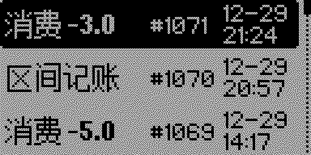

# T-Union Master

🐬🚇💳 交通卡大师

## 📖Description

T-Union Master（交通卡大师）是基于 [flipper zero](https://flipperzero.one/) 平台用以查询[交通联合卡](https://zh.wikipedia.org/wiki/%E4%BA%A4%E9%80%9A%E8%81%94%E5%90%88)综合信息的工具。

查询内容包括卡号、卡名、卡种、到期日期、余额等基础信息，充值、交易记录（10 条），交通工具、线路、站台等行程信息（30 条），查询方式为离线查询，无需蓝牙 wifi 等。

本应用使用 flipper zero 设备内建 NFC 外设及系统固件提供的 ISO/IEC 14443 (Type 4A) 协议栈与卡片通讯，应用层协议参考 EMV 标准以及交通运输部 JT/T 978 标准。

参考：[卡片协议分析记录](docs/card_data_format.md)

内置 GB2312 12px 不等宽汉字库，无需中文固件，应用内信息及站台名为中文显示；内置交通线路及站台数据库，支持情况如下。

[支持的城市及线路](docs/supported_cities.md)

## 💻Usage

### 主菜单界面


### 卡片基础信息

显示余额、卡号、卡名信息

导航键左：转到交易记录查询

导航键右：转到详细信息查询


### 卡片详细信息

显示签发、到期日期，发卡地、卡种信息

导航键左：返回卡片基础信息


### 交易记录

展示 10 条交易信息，按照从最近到最早排序，包含交易类型、交易金额、交易序号、时间（月日时分）信息。

导航键上下：滚动记录列表

导航键左：转到行程记录查询

导航键右：返回卡片基础信息



### 交易详情

显示所选交易记录的类型、金额、序号、时间戳、终端 id 信息

导航键上下：详情信息翻页

导航键返回：回到交易记录列表


### 行程记录

展示 30 条行程信息，按照从最近到最早排序，包含站台名、时间（月日时分）信息。

下方分别显示【进站】【出站】【换乘】【夜间】【漫游】记录属性图标。

导航键上下：滚动记录列表

导航键右：转到交易记录查询


## 🔨 Building

使用 Flipper Zero SDK 工具（[ufbt](https://github.com/flipperdevices/flipperzero-ufbt)）进行构建，基于[mntm-012](https://github.com/Next-Flip/Momentum-Firmware/releases/tag/mntm-012) 固件开发，需手动指定 SDK 版本

城市 id 数据库及线路站台数据库需要在构建前手动执行脚本生成，构建脚本需要安装依赖库

ufbt 与数据库生成脚本均需要 Python3 运行环境，确保系统中已安装 Python3

```bash
# 克隆本项目(或下载源码包)
git clone https://github.com/SocialSisterYi/T-Union_Master
cd T-Union_Master

# 安装ufbt和数据库生成脚本的依赖
pip install ufbt
pip install -r requirements.txt

# 安装指定的SDK
ufbt update -t f7 -u https://github.com/Next-Flip/Momentum-Firmware/releases/download/mntm-010/flipper-z-f7-sdk-mntm-010.zip

# 生成数据库
python compile_database.py

# 编译工程
ufbt
```

通过 qFlipper 或 `ufbt launch` 命令上传至 flipper zero

## 🚩TDL

- 深圳地铁站台信息 Terminal ID 反查
- 行程记录详情界面
- 行程记录列表文字滚动显示
- 开屏欢迎画面
- 北京卡优惠信息
- 公交线路解析
- 读取日志功能

## 📝Changelogs

v0.1: 上传 github 项目

## ⚠️Disclaimers

- 本项目以 GPL-3.0 License 作为开源协议，这意味着你需要遵守相应的规则
- 本项目仅适用于学习研究，任何人不得以此用于盈利
- 使用本项目造成的任何后果与本人无关

## 🎉Thanks

以下项目为本项目提供了部分技术参考和灵感，在此鸣谢。

- [Trip Reader 读卡识途](https://www.domosekai.com/reader/index.html)
- [NFSee](https://github.com/nfcim/nfsee)
