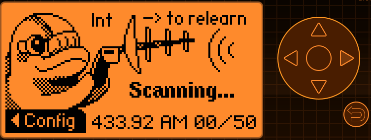

# TPMS application for [Flipper Zero](https://flipperzero.one/)
[](https://flipc.org/wosk/flipperzero-tpms)

## Features
- Read [TPMS](https://en.wikipedia.org/wiki/Tire-pressure_monitoring_system) sensors
- Relearn by 125kHz signal activation
- Multiple scan modes for different use cases
- Sweep mode for automatic frequency/modulation discovery

## Supported Sensors
| Protocol | Frequency | Modulation | Vehicles |
|----------|-----------|------------|----------|
| Schrader GG4 | 433.92 MHz, 315 MHz | AM | KIA Sportage, Mercedes-Benz, and others |
| Schrader SMD3MA4 | 433.92 MHz, 315 MHz | AM | Subaru (Ascent, Crosstrek, Forester, Impreza, Legacy, Outback, WRX), Nissan 370Z, Infiniti FX/EX/G, Renault Koleos |
| Schrader EG53MA4 | 433.92 MHz, 315 MHz | AM | Chevrolet (Bolt EV/EUV, Volt, Silverado), Saab, Opel, Vauxhall |
| Abarth 124 (VDO TG1C) | 433.92 MHz | FM | Abarth 124 Spider, Fiat 124 Spider, Mazda MX-5 ND |

**Note:** US vehicles typically use 315 MHz, while European vehicles use 433.92 MHz.

## Scan Modes

### Activate + Scan
Allows manual 125kHz activation by pressing the Right button. Use this when you have the sensor nearby and want to trigger it on demand. The display shows "-> to activate" as a reminder.

### Scan Only
Passive listening mode without 125kHz activation. Useful when:
- The car is moving (sensors transmit automatically)
- Testing sensors that are already transmitting
- You don't want to trigger nearby sensors

### Sweep (Discovery)
Automatic discovery mode that cycles through all frequency and modulation combinations to find your sensor. Configurable options:
- **Starting frequency:** 433.92 MHz or 315 MHz
- **Starting modulation:** AM650, AM270, FM238, FM476
- **Cycles:** 1-10 (default: 3)
- **Time per combo:** 1-10 seconds (default: 4)

Sweep mode will:
1. Trigger 125kHz activation at the start of each combination
2. Listen for the configured time
3. Move to the next modulation/frequency combination
4. Show current cycle number and countdown timer
5. Stop automatically when a signal is found or all cycles complete
6. Display a summary showing success/failure and detected settings

## How to Use

### Basic Usage
1. Select a scan mode from the main menu
2. For **Activate + Scan**: Hold the sensor near Flipper's back (like an RFID card) and press Right to activate
3. Watch for RSSI meter jumps indicating transmission
4. When a sensor is detected, it appears in the list with Model and ID
5. Press OK to view temperature and pressure details

### Finding Unknown Sensor Settings
If you don't know your sensor's frequency/modulation:
1. Select **Sweep (Discovery)** from the main menu
2. Configure settings or use defaults
3. Press **Start Sweep**
4. Hold the sensor near Flipper's back
5. The app will automatically find the correct settings

### When Sensors Transmit
- **While driving:** Sensors transmit periodically
- **Emergency:** Rapid pressure loss or temperature spike triggers transmission
- **Relearn mode:** 125kHz activation forces immediate transmission (sensor must be near Flipper)



## Building

```bash
# Clone the repository
git clone https://github.com/wosk/flipperzero-tpms.git
cd flipperzero-tpms

# Build with ufbt
ufbt

# Deploy to Flipper
ufbt launch
```

## Contributing
Feel free to contribute via PR or report issues.

## Credits
- Original code based on [weather station app](https://github.com/flipperdevices/flipperzero-good-faps/tree/dev/weather_station)
- Protocol implementations reference [rtl_433](https://github.com/merbanan/rtl_433)
