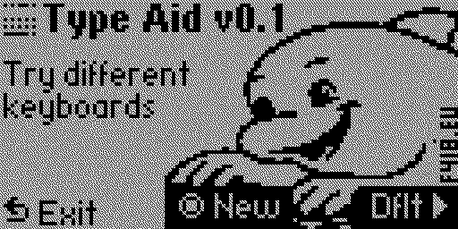
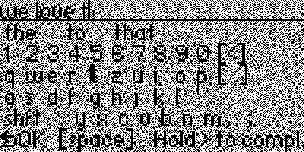

# mitzi-tyaid

&nbsp;
&nbsp;

My take on a Flipper Zero type-aid. You can compare my version with out-complete with the standard keyboard.

## Usage
From the main screen, you have three options:

- **OK** opens the keyboard with with word suggestions
- **Right**  opens the standard Flipper Zero keyboard
- **Back** exits the application

On the new keyboard, the user navigates using the directional buttons, **OK** selects the highlighted character or button.
* The backspace button **[<]** deletes the last character.
* The **shft** button toggles between lowercase and uppercase (respective symbols for the numbers).
* The **[ space ]** button inserts &mdash; no suprise here &mdash; a space.

The 1st line on the screen displays the entered text, the 2nd line is the word prediction. As you enter characters, up to three word suggestions appear. To use one of them, hold the **Right**-button to cycle through available options, the currently selected suggestion is shown in bold. Pressing **OK** accepts the suggestion.
  
## Version history
See [changelog.md](changelog.md)

 &nbsp;
