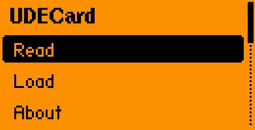

# 🪪🔍 UDECard

Flipper Zero application to analyse student ID cards from the University of Duisburg-Essen (Intercard)

> [!TIP]
> Download UDECard [directly from the Flipper Application Catalog](https://lab.flipper.net/apps/udecard)

## Motivation

The University of Duisburg-Essen utilises a system known as Intercard for the purposes of payment and authentication within the library.
These are MIFARE Classic 1K cards, whose keys are readily available in the Flippers dictionary.
However, the Flipper lacks any support for useful information extraction.
This application enables parsing of such cards.

> [!IMPORTANT]
> For legal reasons, no keys for reading the card are included in this application.
> Hence, your Flipper Zero has to have the usual `mf_classic_dict.nfc` installed (it probably does).
> The functionality of this application is limited to parsing the contents of the card.
> No modifications are possible or will be made possible in the future.
> **[See legal information (in German)](docs/Legal.md)**

Should you have any Intercards from other institutions, you may find the [Technical Details](docs/Technical_Details.md) document helpful.

## Properties this app supports

- KS-Nr.
- Member type (Student/Employee)
- Student number (Matrikelnummer)
- Balance
- Transaction count

## Build/Install

### Flipper Application Catalog

You can install it [from the Flipper Application Catalog](https://lab.flipper.net/apps/udecard) using the Flipper Mobile App or Flipper Lab.

### Manual installation

Alternatively, you can manually download the latest release [here on GitHub](https://github.com/hahnworks/UDECard/releases).

For building/installing from source, running `ufbt` / `ufbt launch` is sufficient.

## Usage

### Reading directly from the card

- Select **Read**.
- Place the card on the back of the flipper.

### Loading previously made dump

- Use the Flipper’s built-in NFC App to create a dump of your card.
- Open UDECard and select **Load**.
- Select the previously created dump.

## Acknowledgements

### Copyright

- `images/ApplyFlipperToUDE_60x50.png` is based on `NFC_manual_60x50.png` from the [Flipper Zero Firmware](https://github.com/flipperdevices/flipperzero-firmware)
- `images/loading_24x24.png` is taken from `Loading_24` from the [Flipper Zero Firmware](https://github.com/flipperdevices/flipperzero-firmware)
- `images/Nfc_10x10.png` is taken from `Nfc_10px.png` from the [Flipper Zero Firmware](https://github.com/flipperdevices/flipperzero-firmware)
