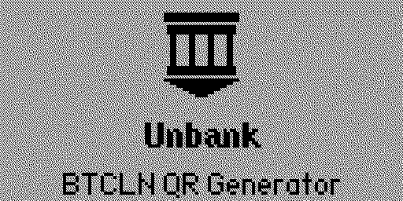
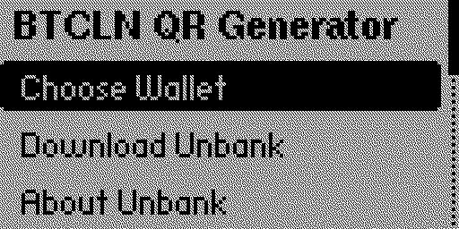
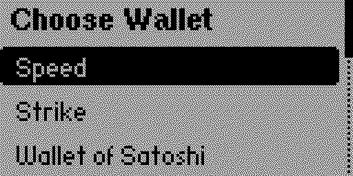
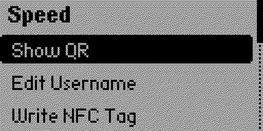
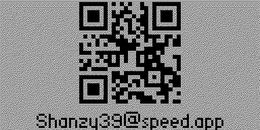
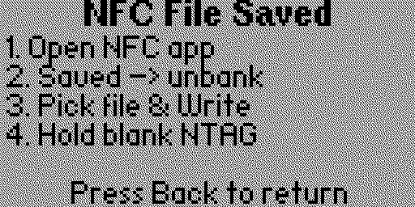
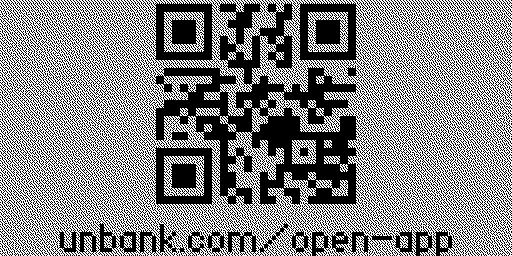
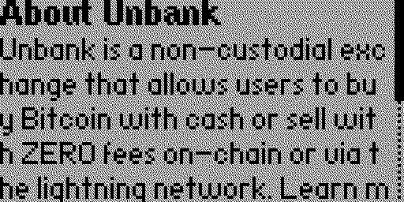
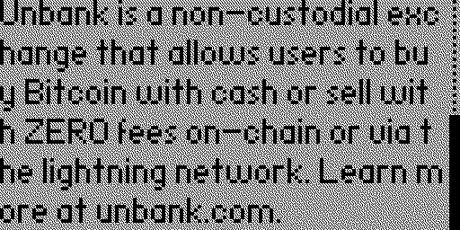

# Unbank BTCLN QR Generator

A Flipper Zero app for receiving Bitcoin over the Lightning Network.
Generate scannable Lightning Address QR codes for **Speed**, **Strike**, or
**Wallet of Satoshi** — with on-device username editing and NDEF `.nfc`
tag file export for writing physical NFC stickers.

---

## Features

- **Multi-wallet support** — Three preset wallets out of the box:
  Speed (`@speed.app`), Strike (`@strike.me`), and Wallet of Satoshi
  (`@walletofsatoshi.com`).
- **On-device username editor** — Type your Lightning Address username
  right on the Flipper using the built-in keyboard. The wallet suffix
  is appended automatically so you never need to enter `@` or `.`.
- **Persistent storage** — Usernames are saved to the SD card per wallet
  and survive reboots and uninstall/reinstall.
- **Equal-sized QR codes** — Every QR renders at the same on-screen
  size regardless of how much data is encoded, for a consistent look.
- **Quick QR** — One tap shows the QR for the wallet you used last,
  skipping the picker for repeat use.
- **Manual refresh** — Tap any QR to regenerate it on demand.
- **Haptic feedback** — A single vibration buzz confirms the QR is
  shown.
- **NFC tag file export** — Generate a `.nfc` file for each wallet
  with a selectable tag type (**NTAG213**, **NTAG215**, or
  **NTAG216**) that the stock Flipper NFC app can write to a blank
  sticker. When someone taps the sticker with their phone, their
  Lightning wallet opens with your address pre-filled.
- **Splash screen** — Brand intro on app launch with the Unbank
  silhouette and app name.
- **Download Unbank QR** — Built-in QR pointing to
  `unbank.com/open-app` so anyone can grab the Unbank mobile app.
- **About screen** — Brief description of Unbank with scrolling text.

---

## Screenshots

| Splash Screen | Main Menu | Wallet Selection |
|:---:|:---:|:---:|
|  |  |  |

| Speed Wallet | QR Code | Write NFC Tag |
|:---:|:---:|:---:|
|  |  |  |

| Download Unbank | About (1/2) | About (2/2) |
|:---:|:---:|:---:|
|  |  |  |

---

## Hardware Requirements

- **Flipper Zero** (stock hardware — no add-ons required)
- Firmware: Latest official Release or Release Candidate
- Optional: Blank NTAG213 NFC sticker (for the NFC tag export feature)

---

## Installation

### Option 1: Flipper Application Catalog (recommended)

Once approved on the catalog, just search **"Unbank BTCLN QR"** at
[lab.flipper.net](https://lab.flipper.net) and click Install.

### Option 2: Build from source

Requirements: Python 3 + a USB cable.

```bash
# Install the Flipper build tool (once)
pip3 install --upgrade ufbt

# Clone this repo
git clone https://github.com/shanzy39/Unbank-BTCLN-QR-Generator.git
cd Unbank-BTCLN-QR-Generator

# Plug in your Flipper, then:
python3 -m ufbt launch
```

The app installs to **Apps → Tools → Unbank LN QR** on your Flipper.

---

## How to use

### 🟢 Show a Lightning Address QR

1. Open **Unbank LN QR** from the Apps menu
2. After the splash screen, the main menu appears
3. Select **Choose Wallet**
4. Pick a wallet (Speed / Strike / Wallet of Satoshi)
5. Select **Show QR**
6. The QR fills the screen with your Lightning Address shown below it
7. Anyone with a Lightning wallet can scan it to send you sats
8. Press **Back** to return to the wallet menu

### ⚡ Quick QR

1. From the main menu, select **Quick QR**
2. The QR for the wallet you used most recently appears instantly,
   skipping the wallet picker
3. Press **Back** to return to the main menu

The last-used wallet is remembered on the SD card, so Quick QR keeps
working across reboots.

### ⌨️ Edit your username

1. From the main menu, go **Choose Wallet → [your wallet] → Edit Username**
2. The on-screen keyboard appears with your current username pre-filled
3. Type your username using letters and numbers — the app handles
   the `@speed.app`, `@strike.me`, or `@walletofsatoshi.com` suffix for you
4. Press the **Save** key on the keyboard (the highlighted button)
5. Your new username is written to the SD card and used for all future QRs

Each wallet stores its own username, so you can have a different handle
for Speed than you do for Strike.

### 📲 Download Unbank QR

1. From the main menu, select **Download Unbank**
2. A QR appears pointing to `unbank.com/open-app`
3. Anyone scanning it with their phone camera lands on the Unbank
   download page

### ℹ️ About Unbank

1. From the main menu, select **About Unbank**
2. Use **Up / Down** on the d-pad to scroll through the description
3. Press **Back** to return to the main menu

### 📡 Write a Lightning Address to an NFC tag

You'll need a blank NTAG213, NTAG215, or NTAG216 sticker (≈ $5 for a
10-pack on Amazon). Pre-programmed or write-protected tags won't work.

1. From the main menu, go **Choose Wallet → [your wallet] → Write NFC Tag**
2. Pick your tag type: **NTAG213**, **NTAG215**, or **NTAG216**
3. The app saves a `.nfc` file to `SD:/nfc/unbank/[wallet]_[ntagtype].nfc`
4. A confirmation screen shows the steps. Press **Back** to dismiss
5. Open the built-in **NFC** app on your Flipper (Main menu → NFC)
6. Go to **Saved → unbank →** the file for your wallet
7. Tap **Write**
8. Hold a blank NTAG sticker against the back of your Flipper
9. Done — anyone tapping that sticker with their phone will see their
   Lightning wallet open with your address ready to send

---

## Customizing

### Adding more wallets

Open `unbank_ln_qr.c` and add to the `WALLETS` array near the top:

```c
static const WalletInfo WALLETS[WalletCount] = {
    [WalletSpeed]  = {"Speed",             "@speed.app",            "speed.txt"},
    [WalletStrike] = {"Strike",            "@strike.me",            "strike.txt"},
    [WalletWoS]    = {"Wallet of Satoshi", "@walletofsatoshi.com",  "wos.txt"},
    // Add new wallets here, e.g.:
    // [WalletAlby] = {"Alby",             "@getalby.com",          "alby.txt"},
};
```

Add the matching enum value to the `Wallet` enum above, then rebuild
with `python3 -m ufbt launch`.

### Changing the app icon

Edit the `rows` array in `make_icon.py` (a 10×10 ASCII grid where `#`
is a black pixel, `.` is empty) and run:

```bash
python3 make_icon.py
```

This regenerates `icon.png`. Rebuild the app to bundle the new icon.

### Changing the splash screen

Edit `splash_view_draw()` in `unbank_ln_qr.c`. The bank silhouette is
drawn by `draw_bank_silhouette()`. Text strings and positions are
plain `canvas_draw_*` calls, easy to tweak.

---

## File reference

| File              | What it does                                                |
|-------------------|-------------------------------------------------------------|
| `application.fam` | Flipper app manifest (name, icon, category, version)        |
| `unbank_ln_qr.c`  | Main app source — menus, views, NFC writer                  |
| `qrcodegen.c/.h`  | Project Nayuki's QR code library (MIT-licensed, bundled)    |
| `icon.png`        | 10×10 monochrome PNG app icon                               |
| `make_icon.py`    | Script to regenerate `icon.png` from an ASCII grid          |
| `LICENSE`         | MIT license                                                 |

---

## Technical notes

- Built and tested against current official Flipper Zero firmware
- Uses standard Flipper SDK modules: `gui`, `storage`, `notification`
- QR rendering uses non-uniform pixel scaling so every QR fills the
  same on-screen area regardless of how many modules it contains
- NFC export format: NTAG213/215/216 with an NDEF URI record encoding
  `lightning:user@host`. The capability-container size, Mifare version
  byte, BCC bytes, and factory config pages are set per tag type.
  Compatible with iOS and Android's native NFC reading
- The keyboard accepts letters, numbers, and underscore — the wallet
  suffix is appended automatically so you don't need to type `@` or `.`

---

## Acknowledgements

- QR code generation by [Project Nayuki](https://www.nayuki.io/page/qr-code-generator-library) (MIT)
- Built for [Unbank](https://unbank.com) — a non-custodial Bitcoin exchange

## License

[MIT](LICENSE) — do whatever you want, just keep the copyright notice.
