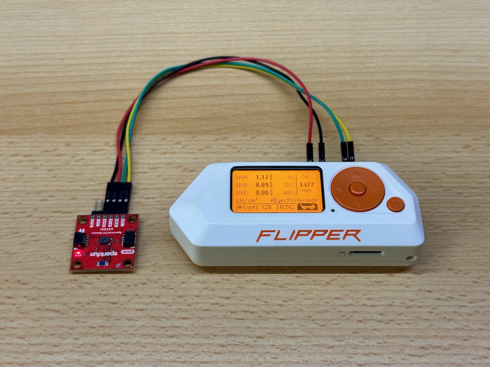
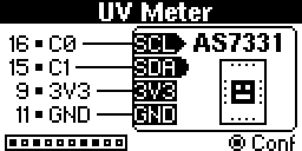
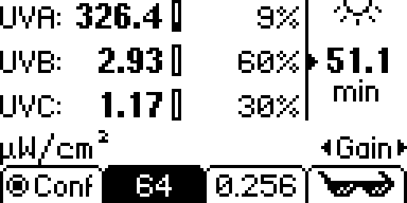

# UV Meter

A Flipper Zero application designed to measure ultraviolet (UV) radiation levels using the [AS7331](https://ams-osram.com/products/sensor-solutions/ambient-light-color-spectral-proximity-sensors/ams-as7331-spectral-uv-sensor) sensor. It supports individual measurements for UV-A, UV-B, and UV-C wavelengths. The easiest way to hook everything up is to use a breakout board, such as the one from [SparkFun](https://www.sparkfun.com/sparkfun-spectral-uv-sensor-as7331-qwiic.html).

## Wiring

Connect the AS7331 sensor to your Flipper Zero via I²C:

| Sensor Pin | Flipper Zero Pin   |
|------------|--------------------|
| **SCL**    | C0 [pin 16]        |
| **SDA**    | C1 [pin 15]        |
| **3V3**    | 3V3 [pin 9]        |
| **GND**    | GND [pin 11 or 18] |

By default, the application scans all possible I²C addresses for the sensor. However, you can manually set a specific address in the settings menu, accessible by pressing the **Enter** button.

## Usage

Once connected, the application automatically displays real-time UV measurements. The main screen shows individual UV-A, UV-B, and UV-C readings. Beneath the numbers you see the currently used unit (µW/cm², W/m² or mW/m²).

Next to each UV reading is a small meter indicating the raw sensor value. If this value is too high or too low, a warning symbol will appear, signaling potential sensor overexposure or underexposure. This condition will probably result in unreliable measurements. Adjusting the **Gain** and **Exposure Time** settings (similar to camera ISO and shutter speed) at the bottom of the screen can help correct this.

In addition to direct sensor measurements, the application provides an interpretation of this irradiance data on human safety, displayed on the right side of the screen. The time (in minutes) indicates the recommended maximum daily exposure duration during an 8-hour work shift, based on the 2024 Threshold Limit Values (TLVs) and Biological Exposure Indices (BEIs) published by the [American Conference of Governmental Industrial Hygienists (ACGIH)](https://en.wikipedia.org/wiki/American_Conference_of_Governmental_Industrial_Hygienists).

Since UV radiation poses greater risks to the eyes, the app includes a setting to specify whether your eyes are protected. This adjusts the maximum daily exposure duration according to ACGIH recommendations.

The displayed percentages indicate how much each UV type (UV-A, UV-B, UV-C) contributes to the maximum daily exposure. This helps illustrate that higher sensor readings don't necessarily mean a greater health risk; for example, even though UV-A sensor values are typically higher, they usually contribute less to the recommended maximum exposure limit compared to UV-B or UV-C.

When following the maximum daily exposure duration, the TLV/BEI guidelines ensure:

> “[...] nearly all healthy workers may be repeatedly exposed without acute adverse health effects such as erythema and photokeratitis.”

## Disclaimer

This application is provided for informational purposes only and should not be used as a sole basis for safety-critical decisions. Always follow official guidelines, regulations, and professional advice regarding UV exposure. The developer assumes no responsibility for any damages, injuries, or consequences arising from decisions or actions based on the information provided by this application.
