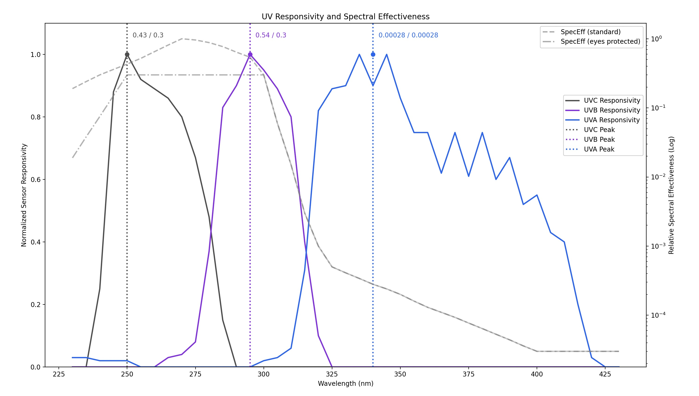
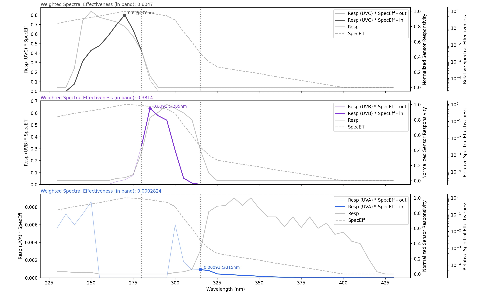
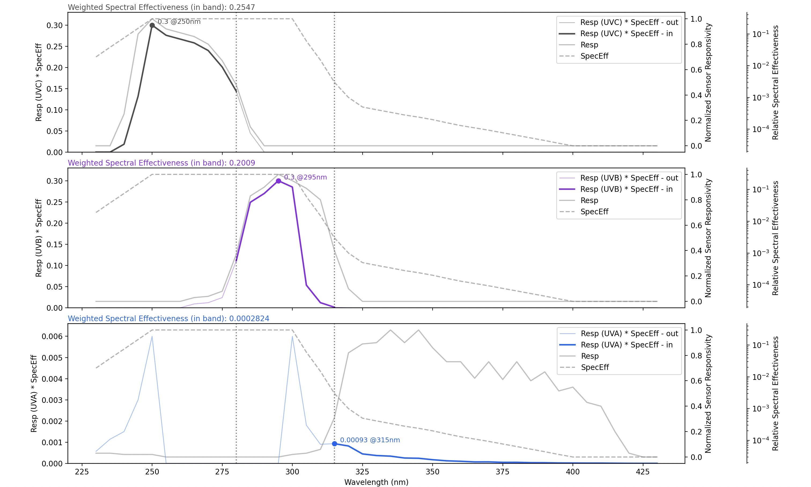

# Magic Numbers Explained

In the source code, within the [`uv_meter_data_calculate_effective_results()`](../views/uv_meter_data.cpp#L668) function, you'll see some seemingly arbitrary ("magic") numbers. They’re essential for converting raw UV sensor values into what's called "Effective Irradiance", which is then used to calculate the maximum daily exposure duration shown in the application:

```cpp
UVMeterEffectiveResults
    uv_meter_data_calculate_effective_results(const AS7331::Results* results, bool eyes_protected) {
    // Weighted Spectral Effectiveness
    double w_spectral_eff_uv_a = 0.0002824;
    double w_spectral_eff_uv_b = 0.3814;
    double w_spectral_eff_uv_c = 0.6047;

    if(eyes_protected) { // 😎
        // w_spectral_eff_uv_a is the same
        w_spectral_eff_uv_b = 0.2009;
        w_spectral_eff_uv_c = 0.2547;
    }
    UVMeterEffectiveResults effective_results;
    // Effective Irradiance
    effective_results.uv_a_eff = results->uv_a * w_spectral_eff_uv_a;
    effective_results.uv_b_eff = results->uv_b * w_spectral_eff_uv_b;
    effective_results.uv_c_eff = results->uv_c * w_spectral_eff_uv_c;
    effective_results.uv_total_eff =
        effective_results.uv_a_eff + effective_results.uv_b_eff + effective_results.uv_c_eff;

    // Daily dose (seconds) based on the total effective irradiance
    double daily_dose = 0.003; // J/cm^2
    double uW_to_W = 1e-6;
    effective_results.t_max = daily_dose / (effective_results.uv_total_eff * uW_to_W);
    return effective_results;
}
```


## Why These Numbers?

Before diving deeper, here's a quick explanation of what we're doing:

1. We start with raw UV-A, UV-B, and UV-C values from the sensor (in µW/cm²).
2. Multiply these raw values by the magic numbers to get "Effective Irradiance".
3. Sum these results to get a total effective irradiance.
4. Use a defined daily dose (`0.003 J/cm²`) to determine how long you'd need to be exposed at this irradiance level to reach that safe daily limit.
5. Finally, this calculated duration is displayed on the Flipper screen.


## But Where Did They Come From?

These numbers are derived using two key documents:

- The datasheet of the [AS7331 UV sensor](https://ams-osram.com/products/sensor-solutions/ambient-light-color-spectral-proximity-sensors/ams-as7331-spectral-uv-sensor).
- The 2024 guidelines for [Threshold Limit Values (TLVs) and Biological Exposure Indices (BEIs)](https://en.wikipedia.org/wiki/Threshold_limit_value) published by the [American Conference of Governmental Industrial Hygienists (ACGIH)](https://en.wikipedia.org/wiki/American_Conference_of_Governmental_Industrial_Hygienists). Specifically, the chapter on "Ultraviolet Radiation", which, among other things, defines the daily exposure limit as `0.003 J/cm²`. Unfortunately, this document isn't freely accessible.


## Effective Irradiance Explained

"Effective Irradiance" isn't just the raw UV sensor data–it's adjusted based on the human body's sensitivity to different UV wavelengths. Some wavelengths are more harmful than others, with the peak danger at 270 nm (in UV-C). At this peak, the "Relative Spectral Effectiveness" value is 1.0, and it decreases as wavelengths get shorter or longer.

But here's the catch: the AS7331 sensor provides just one reading for each UV range:

- UV-A (315–410 nm)
- UV-B (280–315 nm)
- UV-C (240–280 nm)

However, the Relative Spectral Effectiveness values are listed individually every 5 nm. So, how do we pick a representative number? That’s exactly the puzzle I had to solve—and the magic numbers are my solution.


## The Method Behind the Magic



My approach was to create a weighted spectral effectiveness curve by merging the sensor's Responsivity curves with the "Relative Spectral Effectiveness" curves, effectively combining both the sensor's sensitivity and the biological impact of each UV wavelength.

The initial results seemed quite conservative, so I refined the approach by considering only the weighted effectiveness within clearly defined wavelength bands, ensuring there was no overlap between the UV channels. However, this meant that I also needed to account for the parts of the UV readings that fell outside those bands. To do this, I calculated a ratio: the total area under the original Responsivity curve compared to the area within the selected bands. This ratio is then applied to the UV readings to adjust for the excluded areas.

The result of these steps is visualized in the two sets of plots below. There are two sets because the "Relative Spectral Effectiveness" varies depending on whether eyes are protected or not:





At the top of each plot, the calculated Weighted Spectral Effectiveness value is displayed. These final numbers became the magic numbers in the code—hopefully providing a balanced and scientifically justified conversion from raw sensor data to Effective Irradiance.

If you're curious or want to double-check my math, feel free to run the `weighted_spectral_effectiveness.py` script included here.


## Final Note and Sanity Check

If you think the maximum daily exposure durations seem quite short, you're not alone. As a sanity check, I considered using the Spectral Effectiveness values at the sensor's peak response (you can see these in the first graph). However, this simpler approach results in similar, and often shorter, daily exposure durations, which suggests that my chosen method isn't far off.

Finally, while these magic numbers might not be the only possible solution, I believe they are reasonable. If you have any insights or alternative approaches I may have missed, feel free to let me know.
