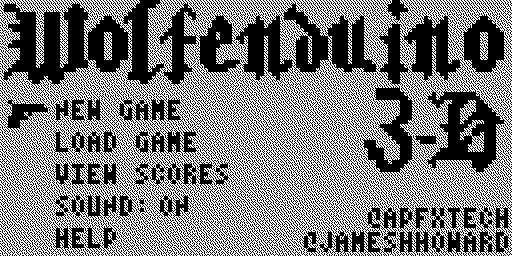
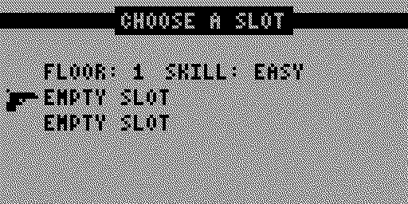
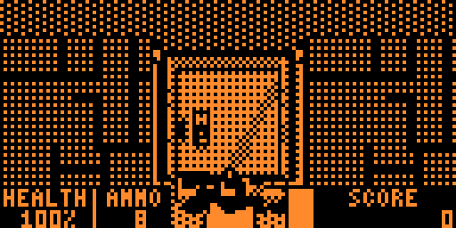
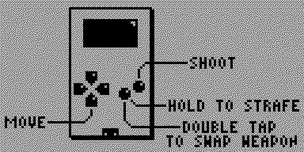

# Wolfenduino

 
Wolfenduino is a demake of id software's Wolfenstein 3D for the Arduboy FX. 

The game recreates the classic shareware episode "Escape from Wolfenstein" with original-style gameplay adapted for portable hardware.

This project is a [port](https://github.com/apfxtech/FlipperWolfenstein.git) of the original [WolfenduinoFX](https://github.com/jhhoward/WolfenduinoFX.git) project. The main goal of this fork is to port the game from the Arduboy console to **Flipper Zero**.

## Features

* 10 Levels based on the shareware episode 'Escape from Wolfenstein'
* Enemies, weapons and secret push walls, all based on the original game
* Four difficulty levels
* An auto-save system that saves your progress at the end of each level
* A high score table

## Screenshots
|                                             |                                             |
| ------------------------------------------- | ------------------------------------------- |
|  |  |
|  |  |
|  |  |

## Controls

* Use directional pad to move
* Press B to shoot
* Hold A to strafe
* Double tap A to switch between weapons
* Press return and down to exit in menu 
* Press return in menu to exit from game

## Assets

An external assets file is required for normal gameplay.

Download the assets file here:  
[fxdata.bin](https://github.com/apfxtech/FlipperWolfenstein/raw/refs/heads/main/package/fxdata.bin)
or from relese.

After downloading, copy the file to the following path on your Flipper Zero:

/ext/apps_data/wolf/fxdata.bin

All other required files will be generated automatically on first launch.

## ⚠️ Performance Warning ⚠️

This game requires a **significant amount of RAM** and places a **heavy load on the CPU**.

For best performance, **do not use USB features** (such as video streaming or debugging) while playing. When USB is active, the processor may not be able to handle both the game logic and the video stream at the same time, which can result in:

- **Severe input lag**
- **Dropped frames**
- **Overall unstable or slow gameplay**

### ✅ Recommended Setup
To ensure smooth performance:
- **Disconnect USB** and run the game **standalone** during play.
- If communication is required, **use BLE (Bluetooth Low Energy)** instead of USB, as it has significantly lower impact on CPU performance.
[FlipperToolkit](https://github.com/apfxtech/FlipperToolkit.git)
