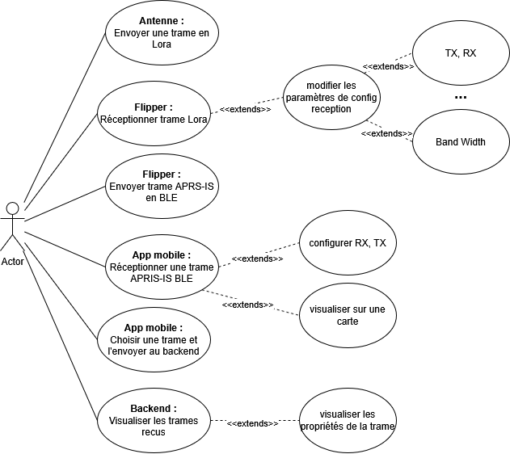

# Testeurs de réseaux IoT satellitaires à base de Flipper Zero

## Cahier des charges


- Une application pour **Flipper Zero** //TODO

- Une application compagnon pour **smartphone** pour récupérer les messages APRS-IS envoyés par le Flipper, les afficher sur une carte et les envoyer à un backend.

- Une application compagnon pour **suivre les ballons stratosphériques** (Sondehub)


Voici le diagramme de cas d'utilisation qui illustre les différentes fonctionnalités de notre projet :


## Développement avec Git

Nous avons adopté une approche de développement structurée avec Git :

### Organisation des dépôts

- **Dépôts séparés** pour chaque composant :
    - Application Flipper Zero
    - Application mobile React Native
    - Backend API
    
Cette séparation permet une meilleure gestion des versions et des dépendances.

### Méthodologie de développement

- **Issues** pour le suivi des tâches et bugs
- **Branches** pour chaque fonctionnalité
- **Commits** sur le master uniquement après validation

Nous avons utilisé les fonctionnalités de GitHub pour organiser le développement :


## Sommaire

- Application Firmware Flipper
- Application compagnon
- Application ballons

## Fonctionnement général

Le diagramme ci-dessous illustre le fonctionnement général du système:


## Application Flipper Zero

*Cette section sera complétée ultérieurement.*

## Antenne LoRa

*Cette section sera complétée ultérieurement.*

## Application mobile

[Git de l'application mobile](https://github.com/nahel-b/flipperApp)

L'application mobile a été développée avec:

- **React Native**: Framework pour le développement d'applications mobiles multiplateformes
- **Expo**: Plateforme facilitant le développement React Native, mais qui présente une limitation concernant le Bluetooth Low Energy (BLE)

### BLE (Bluetooth Low Energy)

Expo ne prend pas en charge le BLE, nous avons utilisé la bibliothèque `react-native-ble-plx` pour gérer la connexion et la communication avec les appareils BLE. Ainsi, nous devions éjecter l'application Expo pour intégrer cette bibliothèque.
Mais cela à posé beaucoup de problèmes avec cocapods et Xcode. Une section entière pour expliquer comment éjecter l'application et résoudre les problèmes rencontrés est disponible dans le [git de l'application mobile](https://github.com/nahel-b/flipperApp).


L'application contient trois onglets :

-  **Compagnon**: Pour scanner les appareils BLE à proximité, récupérer les message, les afficher sur une carte et les envoyer au backend
-  **Ballon**: Pour suivre les ballons stratosphériques sur une carte et afficher leurs propriétés
-  **BLE**: Pour configurer la connexion BLE.

### Architecture BLE du Flipper

- Le périphérique Flipper expose un service BLE principal
- Ce service contient une caractéristique "message" qui permet de:
  - Lire les données (read)


### Traitement des Données BLE

```javascript
setMessages((prev) => [...prev, decoded]);

const parsedMessages = listMessages.map((message) => {
  const parsedMessage = parseAprs(message);
});
```

- Chaque paquet BLE reçu est décodé (base64)
- Les messages sont ajoutés à une liste en attente d'être parsés

### Fonction de Parsing APRS

Le parsing des messages APRS-IS est effectué par la fonction `parseAprs`. Cette fonction prend en entrée une trame APRS-IS et extrait les informations pertinentes. Voici les types de messages pris en charge:

- **Messages**: Extraction des informations comme l'émetteur, le destinataire et le contenu du message
- **Objets**: Extraction des coordonnées géographiques et des détails associés
- **Météo**: Extraction des données météorologiques comme la température et l'humidité
- **Positions**: Extraction des coordonnées GPS et de l'altitude

Le Flipper peut envoyer plusieurs trames en meme temps séparées par des ;

Exemple de trame APRS:
```
"F4ABC-11>APRS,WIDE2-1:!4852.45N/00220.32E>000/000/A=035000 Balloon launch test"
```

Résultat après parsing:
```javascript
{
    type: 'position',
    callsign: F4ABC,
    ssid: -11
    latitude: 48.8742° N
    longitude: 2.3387° E
    Altitude 35000 ft
    commentaire: 'Balloon launch test'
}
```

Une fois le message parsé, il est affiché sur la carte et lorsque l'utilisateur clique sur le message, il ouvre un modal avec les détails du message et un bouton pour l'envoyer au backend.

### Envoi des Données au Backend
- Format JSON pour faciliter le traitement côté serveur
- API REST pour une architecture simple et robuste
- Hébergement sur Scalingo: [https://pocfablab.osc-fr1.scalingo.io/](https://pocfablab.osc-fr1.scalingo.io/)

Ne voulant pas polluer les vrais site de communauté de cubesat, nous avons développé un backend API rest qui permet de recevoir les messages et de les stocker. L'API est accessible à l'adresse suivante:

https://pocfablab.osc-fr1.scalingo.io/api/position

Le backend permet de visualiser les trames qu'il reçoit à cette adresse:

https://pocfablab.osc-fr1.scalingo.io/

### Routes disponibles

- `POST /api/position` : Enregistre une position
    - Corps de la requête : `{ ssid, latitude, longitude }`
    - Retourne : `{ message: 'Position enregistrée' }`

- `GET /api/positions` : Récupère toutes les positions
    - Retourne : Liste des positions enregistrées

- `POST /api/reset` : Réinitialise toutes les positions
    - Retourne : `{ message: 'Positions réinitialisées' }`


## Onglet de suivi des sondes

L'application permet de suivre les ballons stratosphériques via l'api de Sondehub. En inspectant les requêtes envoyées par l'application Sondehub, nous avons pu reproduire les appels API pour récupérer les données des ballons. A chaque fois que l'onglet est chargé, une requête est envoyée pour récupérer les données des ballons. Ces données sont ensuite affichées sur une carte avec un marqueur pour chaque ballon. En cliquant sur le marqueur on peut voir les détails du ballon comme son altitude ou la fréquence de transmission.
