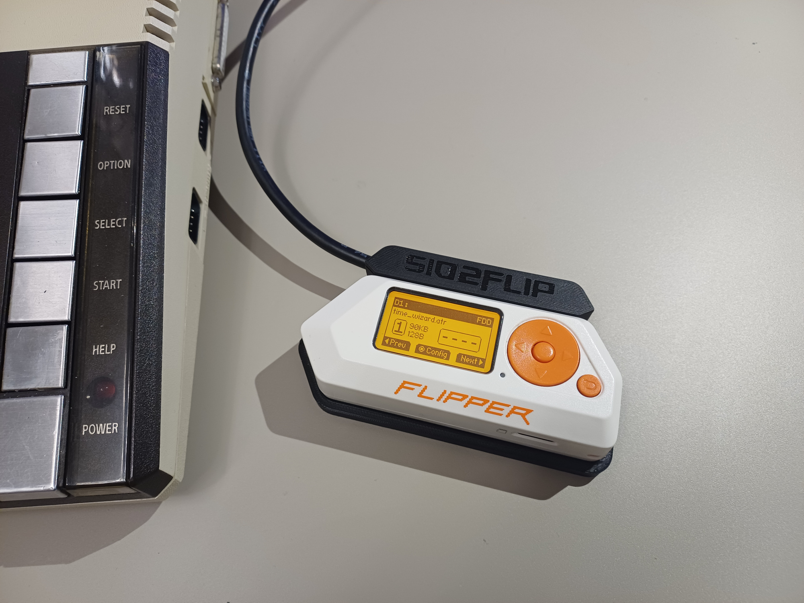
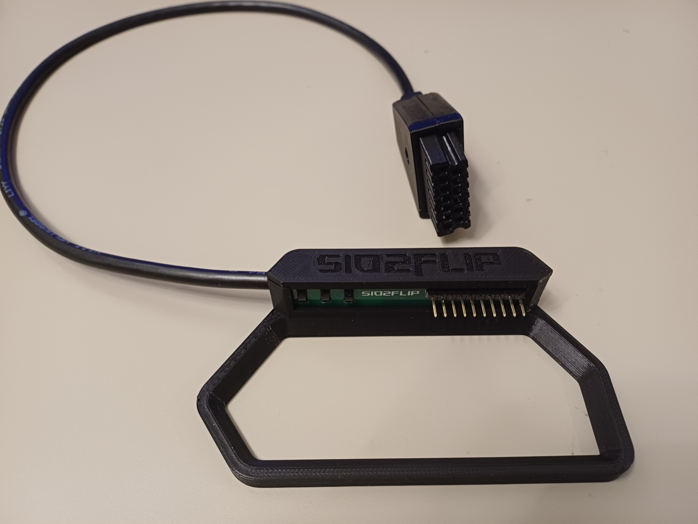
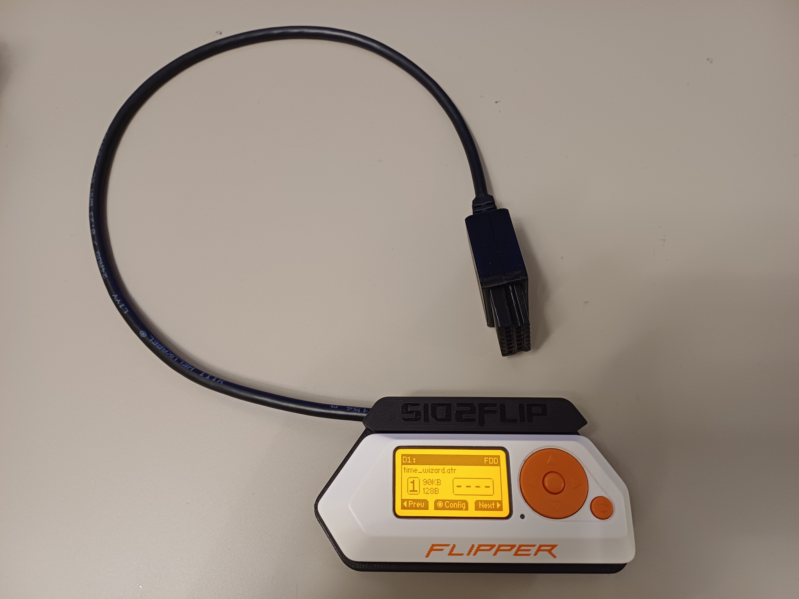
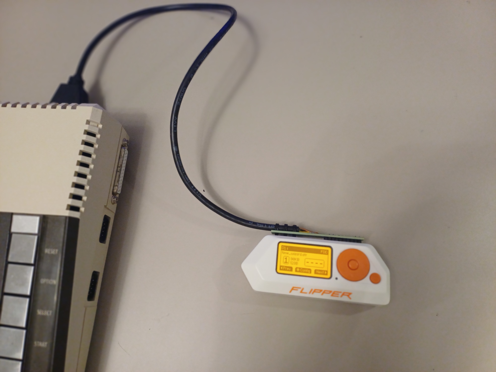
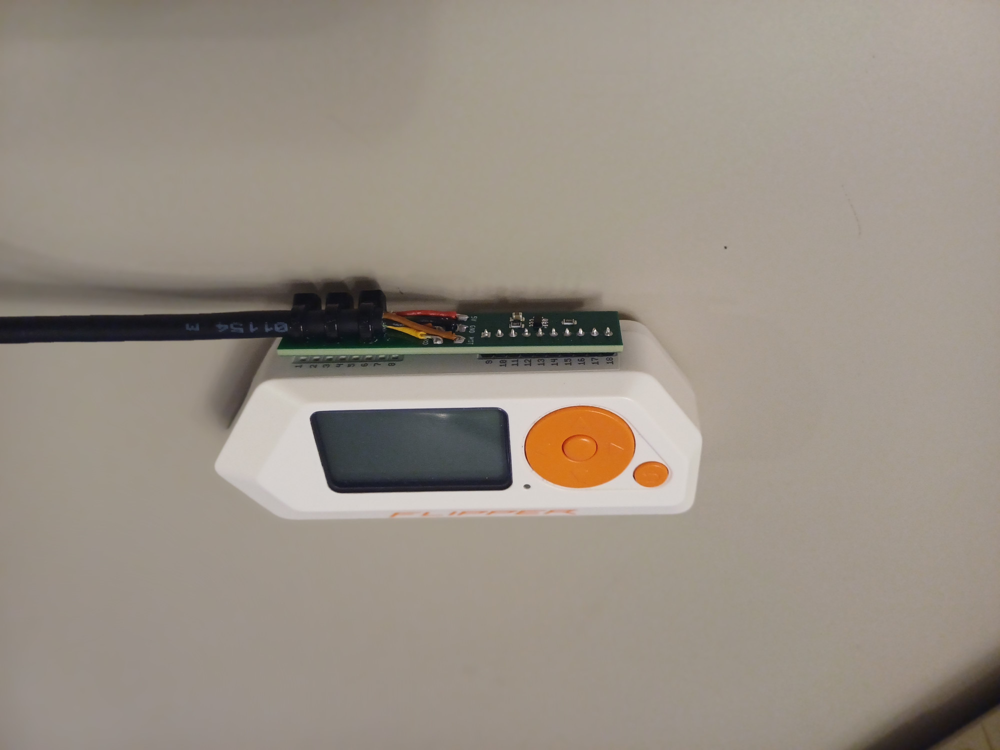
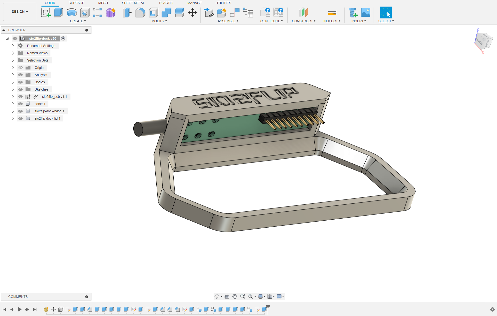

# SIO2FLIP docking station

Although you can connect the Flipper Zero and the Atari directly with just a few wires, you can make it fancier by building a docking station.

In this folder, you can find the schematic, PCB, and 3D model of the docking station case.

## License

Schematics, PCB, Mechanical design files (in hardware/) are licensed under the CERN Open Hardware Licence Version 2 - Strongly Reciprocal. You are free to use, modify, and share them, but if you distribute hardware or modified design files, you must also share your changes under the same license.

See  [LICENSE-CERN](LICENSE-CERN) for details.

