# Usage instructions

## Installation
To install this app simply download the `.fap` file from [latest release](https://github.com/denr01/FZ-ChiefCooker/releases/latest).

Then just copy it to your flipper (to `ext/apps/Sub-GHz` folder).

On your flipper, open up Apps -> Sub-GHz and you should see it there. Just open it as a regular app. 

## Tutorial

### Your first use
Imagine you are on a food court you want to become chief on. 

First, open the app and select "Scan for station signals". 

The app will start receiving signals and show you once it receives something

 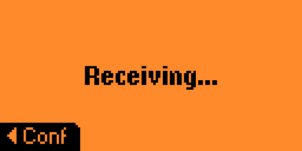 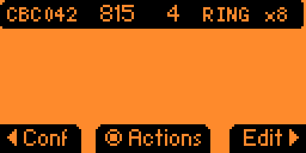

Okay, now you received something. Now, let's test if transmission decoded correctly and find the restaurant who sent the transmission!

To do this, click on center button (actions) and select the first one, "Resend to ALL":

 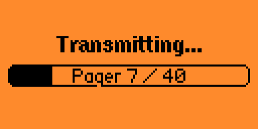

Where are they all running? Is the dinner ready yet? Unfortunately it's not. Just their new chief is learning...

Let's assume that you somehow found out, that it was a restaurant called "Street Food" who sent the signal. Now let's save it's signal to your SD card.

Go back from actions and push the "Edit >" (right arrow) button. Then scroll down to "Save signal as...", give it a name and then create a new category for it. It's convenient to use restaurant name for signal name and mall (or food court/place name where restaurant are located) for the category name to make sure that signals from different places will not mess up. 

 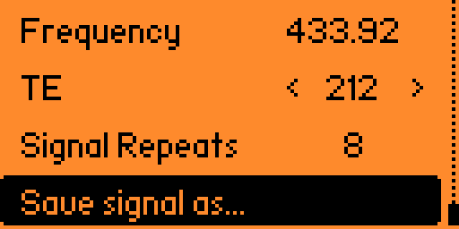 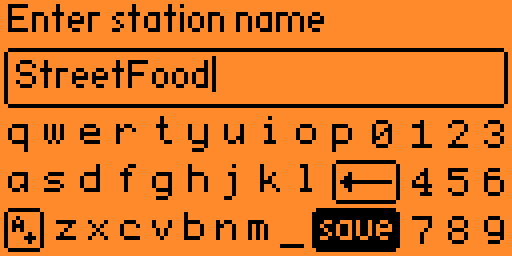

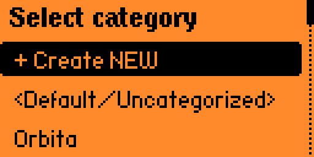  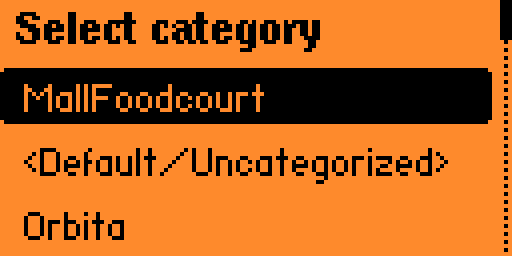

Congratulations! Your saved your first captured signal and now can use it anytime you want to call someone to the restaurant's food pickup.

But it would be great now to distinguish the signals from "Street Food" from the other ones. And you can do it!

Navigate to "< Config" (left button) and select the category to the newly created one. Then go back.

 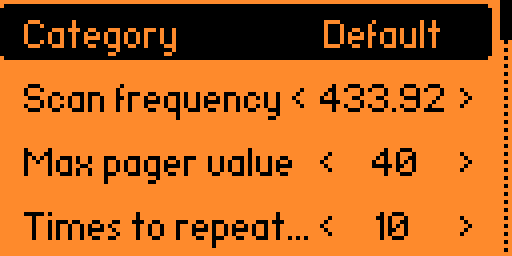 

 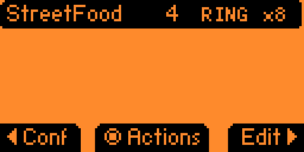

As you can see, now instead of hex value and station number there is a restaurant name you given to the signal. 

And what's this? A new signal? Yes, but not completely new. Street Food just called pager with another number (7). But your flipper successfully recognized their signal because you already saved one to the current category and showed you it's name. 

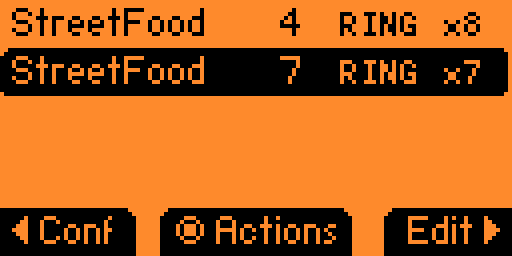

### Your second use

Now imagine you came to the same food court next day and want to call somebody's pager at the Street Food restaurant (that your saved yesterday).

Navigate to "Saved stations" and then select the category of current place / mall / food court:

 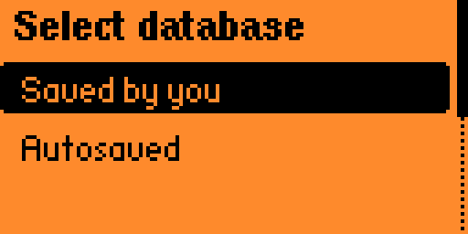 

Here your will see your saved signal:

Now your can do with it whatever you want exactly like when you captured it. 

Let's assume now you need to call only single pager with number 9.

Go to "Edit >" menu, scroll down to "Pager" and change it value to 9. Now just press center button. Your flipper will blink purple LED - like when you were resending to all pagers, remember? This means that it sent the signal.

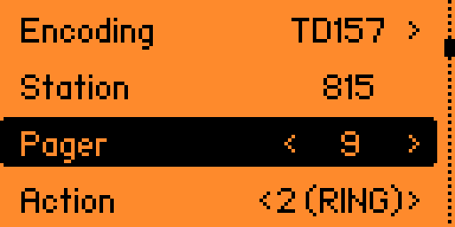

Now imagine we want to receive more signals here. There are two ways to do it:
- Go to "Scan" menu like on your first usage
- Click on "Scan here for more".

The second way is better because you will have all you previously saved signals in quick access in cause you urgently need one of them. New signals will appear here once your flipper receive them.

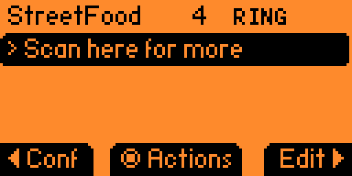 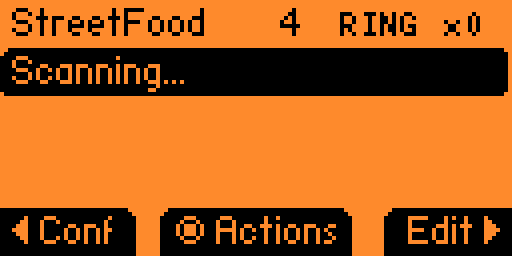 

Congratulations! You have successfully completed the tutorial! ~~Now go and troll someone real.~~

## App's screens explanation

### Scan stations screen

The values here are:
- `CBC042` - signal hex code
- `815` - station number (in current encoding)
- `4` - pager number (in current encoding)
- `RING` - action (in current encoding)
- `x8` - number of signal repeats, will not show more than `x99`

_Note: if you change the signal's encoding in "Edit" menu, station number, pager and action here will also change._

### Edit station screen

There are several things you can edit in captured signal using "Edit >" menu.

First thing is **encoding**. App tries to detect encoding automatically when it receives signal. But in some cases you may need to specify it manually. Here you can change the encoding and see how the values (station number, pager number and action) are changing in real-time:

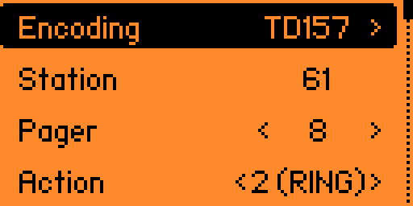  

Also you may need to change pager or action value. You can do it here and see how the hex value changes in real time:

 

_Note: pager number is editable only if it's decoded value is less than 255 in current encoding_

**Also note: pressing the center button on anywhere on the edit screen (except for save as / delete options) will trigger signal transmission with current pager/action/hex value!**

### Config screen

Here some description about config parameters:
- **Category** - the category to load saved station names from. Does not affect if you use option "Scan here for more" in saved stations screen.
- **Scan frequency** - the frequency to receive signals on. For EU/Russia default is 433.92 Mhz, but 315.00 Mhz and 467.75 Mhz may be also used in US or somewhere else.
- **Max pager value** - how many pagers should signal be sent to when using "Resend to ALL" action. Also affects automatic encoding detection feature: the algorithm will use the first encoding which will give a pager number less or equal than current setting value. 
- **Times to repeat signal** - speaks for itself, don't recommend changing it as the default value (10) should work in most cases.
- **Saved stations** - what to do when receive a signal from known station (saved in current category). Possible values are: 
  1. **Ignore** - treat station as unknown, show signal hex and station number.
  2. **Show name** (default) - show saved station name instead of hex value and station number
  3. **Hide** - do not show signals from saved stations at all. Show only unknown signals
- **Autosave found signals** - any found signals will be saved to "Autosaved" folder in the subdirectory with current date. Useful in case app crashes or you accidentally close it without saving. 
